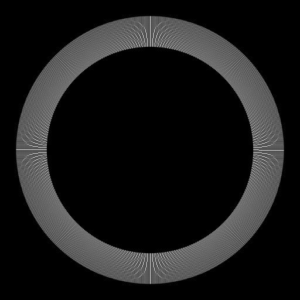

# SGL — Scientific Computing Foundation

A standalone C++ foundation for Solar Gravitational Lens research.

The current implementation provides a Schwarzschild geometric-optics
forward pipeline:

```text
null geodesics → observer arrivals → spherical expansion → Einstein ring
```

## Status

The canonical aligned Schwarzschild configuration can produce an Einstein-ring
intensity distribution from numerically integrated null geodesics.

The current implementation is intentionally minimal. It is a computational
baseline for future SGL experiments, not a complete physical model of the
Solar Gravitational Lens.



## Scope

- Schwarzschild GR / null geodesics
- RK4 propagation
- Ray ensembles
- Observer-plane arrivals
- Geometric-optics image formation
- Numerical validation

Not yet implemented: Kerr, plasma, wave optics, detector physics, or
mission-level SGL modelling.

## Build

```bash
cmake -B build -S .
cmake --build build
ctest --test-dir build --output-on-failure
```

## Run

```bash
./build/sgl_canonical_sgl_image --output-dir outputs/sgl_forward
```

See [`docs/SGL_FORWARD_PIPELINE.md`](docs/SGL_FORWARD_PIPELINE.md) for the
complete implementation and data-flow documentation.
