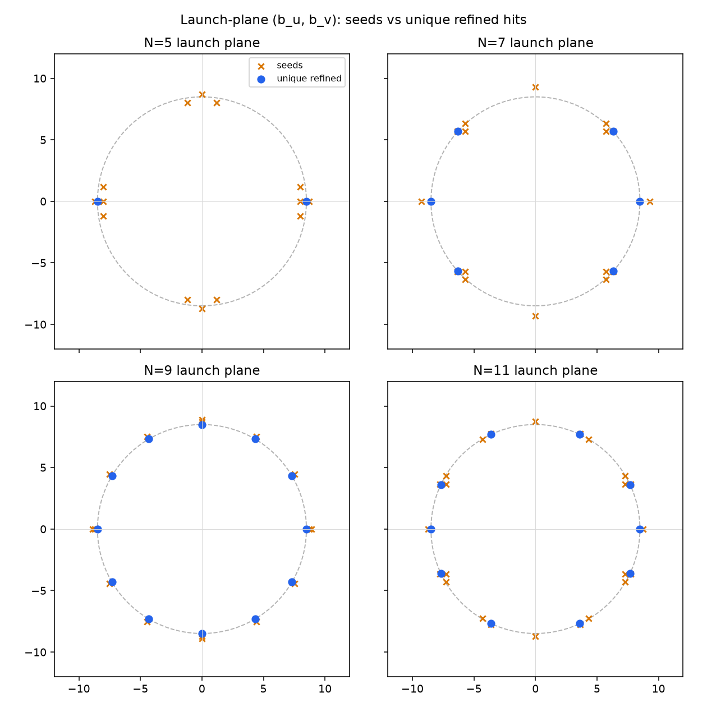
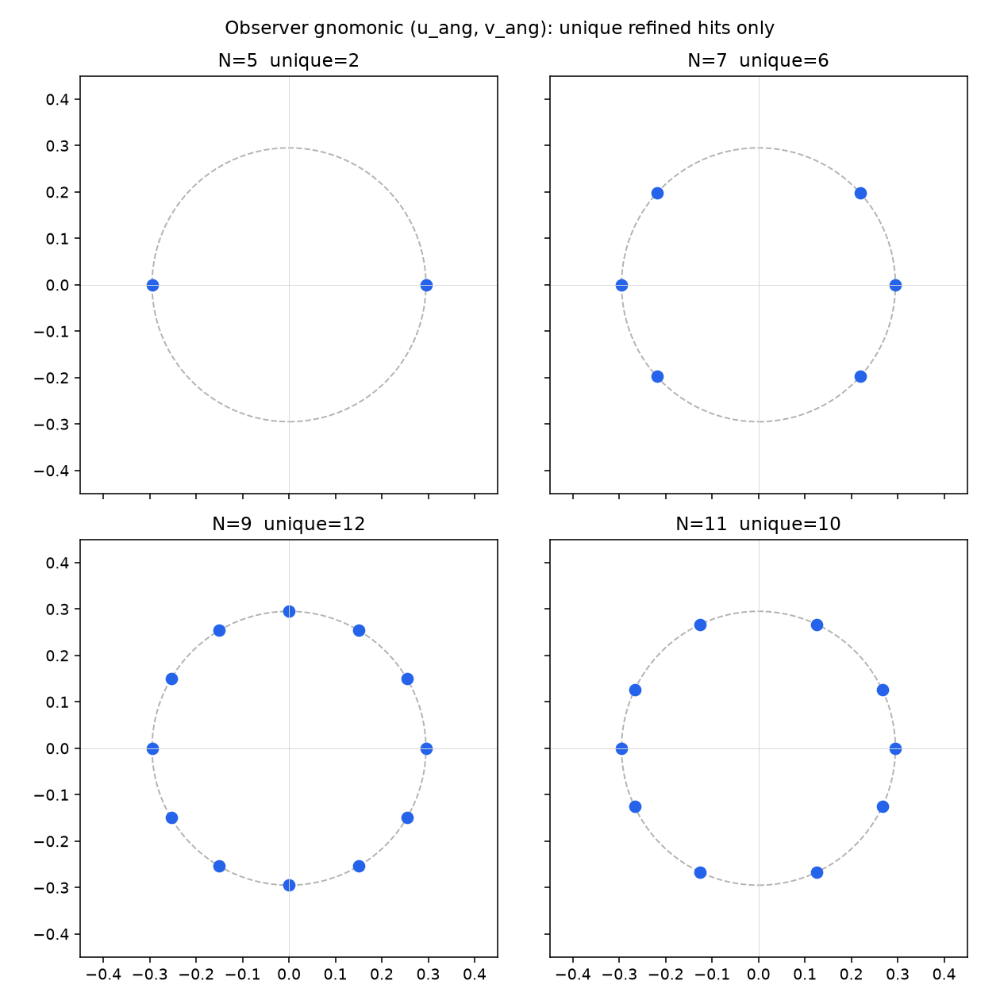

# True 2D Ring Fragmentation Audit

**Investigation only.** No implementation changes. All timings and counts below
come from reduced on-axis runs (`samples-per-axis` ∈ {3,5,7,9,11}),
`source-distance=30`, `observer-axial-distance=30`, `observer-distance=0`,
`b-max=20`, `rs=1`, `step-size=0.01`, `max-steps=300000`,
`observer-hit-tolerance=1e-6`, `max-root-iterations=12`, `OMP_NUM_THREADS=8`.

A throwaway diagnostic (`/tmp/sgl_frag_diag`) linked the existing libraries and
dumped per-ray / per-seed / per-hit tables. Production C++ was not edited.

Diagnostic plots:

- `docs/assets/launch_plane.png` — seeds vs unique refined launches
- `docs/assets/angular.png` — unique refined hits on the observer sky

---

## 1. Current pipeline

Traced from `experiments/true_2d_sgl_image.cpp` `main()`, not from filenames.

```text
RayGrid2DSampler::sample
    N×N cell-centered (b_u, b_v) on [−b_max, +b_max]²
    state_for: world pos = source + b_u X̂ + b_v Ŷ
               world dir = normalize(lens − source)   // always +Z when aligned
               chart cart → sphere → build_custom(Null)
        ↓
collect_arrivals → propagate_ensemble → PlaneCrossingTermination
        ↓
observer_hit_seeds(search residuals)          // not imaged
        ↓
refine_observer_launches
    per seed: refine_launch_to_observer (Gauss–Newton on (b_u, b_v))
    compact; sort by (‖r‖, seed_index); launch-plane dedup
        ↓
for each unique RefinedObserverHit:
    angular_coordinates.push_back(hit.angular_coordinate)
        ↓
form_image(angular_coordinates, resolution, resolution, extent)
        ↓
CSV / PGM  (true_2d_image.*)
```

### What is plotted

**Only unique refined observer hits.** `true_2d_sgl_image.cpp` copies
`hit.angular_coordinate` from each `RefinedObserverHit` and passes that vector
to `form_image`. Search arrivals are not passed in. Seeds are not passed in.
`expand_angular_azimuthally` is **not** called.

The plotted quantity is observer-centered gnomonic

```text
(u_ang, v_ang) = (tan θ_right, tan θ_up)
```

from `observer_angular_coordinates` of each refined arrival’s incoming
`world_direction`.

### Survival (this investigation)

| Stage | 3×3 | 5×5 | 7×7 | 9×9 | 11×11 |
|---|---|---|---|---|---|
| Search rays `N²` | 9 | 25 | 49 | 81 | 121 |
| Plane arrivals | 8 | 24 | 48 | 80 | 120 |
| Seeds | 2 | 14 | 16 | 16 | 24 |
| Newton successes | 0 | 8 | 14 | 16 | 22 |
| Newton failures | 2 | 6 | 2 | 0 | 2 |
| **Unique refined hits = image samples** | **0** | **2** | **6** | **12** | **10** |
| Nonzero pixels at resolution 8 | 0 | 2 | 6 | 12 | 10 |
| Nonzero pixels at resolution 64 | 0 | 2 | 6 | 12 | 10 |

One search ray always fails to arrive: `(b_u, b_v) = (0, 0)` (on-axis into the
lens).

**Image resolution does not create the gaps.** Nonzero pixel count equals the
unique refined-hit count at both 8×8 and 64×64. The fragmentation is already
present in the list of observer samples.

---

## 2. Mathematical formulation (as coded)

Unknowns: launch-plane offsets `(b_u, b_v)` in
`RayGrid2DSampler::state_for`. They are a valid 2D parallel-beam
parameterization: position `(b_u, b_v, −S)`, direction `+Z`.

Residual (two components):

```text
F(b_u, b_v) = image_plane.to_plane_coordinates(world_hit(b_u, b_v)) ∈ R²
```

A root is `‖F‖ ≤ 1e-6` (observer origin). Both components are independent
coordinates on the observer plane. The map is well-defined whenever the geodesic
arrives.

**Expected solution set, aligned Schwarzschild:** a **circle** in launch-plane
space, not isolated points. Spherical symmetry about `+Z` says: if `(b, 0)` is
an observer-hitting launch, so is `(b cos ψ, b sin ψ)` for every `ψ`.

Measured radius of that circle (every unique hit, every N ≥ 5):

```text
sqrt(b_u² + b_v²) = 8.490491…
sqrt(u_ang² + v_ang²) = 0.295034…
```

to ~1e-8 or better. The 1D symmetry-reduced ring uses the same angular radius
(`~0.295034`). Successful 2D points **lie on the correct ring**.

Newton (`refine_launch_to_observer`) treats `F = 0` as an **isolated 2D root**:
2×2 finite-difference Jacobian, damped Gauss–Newton, Broyden updates, max 12
iterations, clamp to `[−b_max, b_max]`.

A 1-dimensional manifold of zeros in 2 unknowns makes that Jacobian
**rank-1** on the circle: the tangential derivative vanishes.

Measured at a successful root `(b_u, b_v) ≈ (8.49049, 0)` with `h = 1e-3`:

```text
J ≈ [[ 2.303 , 1.36e-4 ],
     [ 1.35e-11 , 1.55e-8 ]]
det(J) ≈ 3.56e-8
singular values ≈ (2.303, 1.55e-8)
cond(J) ≈ 1.49e8
```

That is rank-1 to numerical precision: radial residual responds to `b_u`;
motion along `+b_v` (the circle tangent at this point) does not.

---

## 3. Observed behavior

The displayed “ring” is a **finite set of dots** on a circle of radius 0.295034.
Gaps are missing azimuths in that set. The 1D path looks continuous because it
**draws** the circle (`azimuth_count` copies). The 2D path only **discovers**
isolated samples of the same circle.

Unique-hit azimuths (degrees):

| N | azimuths | max gap |
|---|---|---|
| 5 | 0, 180 | 180° |
| 7 | 0, 42, 138, 180, 222, 318 | 96° |
| 9 | 0, 31, 59, **90**, 121, 149, 180, 211, 239, **270**, 301, 330 | 31° |
| 11 | 0, 25, 65, 115, 155, 180, 205, 245, 295, 335 | **50°** (around ±Y) |

N=11 is **not** more complete than N=9. Coverage is not a monotone function of
grid density.





---

## 4. Reduced experimental results

### Counts

See the survival table in §1. Newton success rate is high once seeds exist
(8/14, 14/16, 16/16, 22/24), but **unique** hits are much smaller than successes
at coarse N (8→2 at 5×5) and can **drop** when N increases (12 at 9×9 → 10 at
11×11).

### Residuals of unique hits

All unique hits have `‖F‖` from ~5e-11 to ~6e-7, all below `1e-6`. Radial
stddev of `ρ` is 6e-14 (5×5) to 6e-9 (9×9). Physics of accepted hits is tight.

### Image vs samples

`nonzero_pix8 == nonzero_pix64 == unique hit count`. Sparse physical solutions,
not a dense ring rendered at low `resolution`.

---

## 5. Seed-generation analysis

`observer_hit_seeds` (`ObserverLaunchRefiner.cpp`) does **not** threshold
`‖F‖`. It has no “close enough to the ring” cut. It emits:

1. The global argmin of `‖F‖` among arrived search rays.
2. Every 8-neighbor **local minimum** of `‖F‖` on the grid (non-finite residuals
   skipped).
3. Axis-aligned **edge interpolations**: for neighboring cells `a,b`, if the
   segment `r(t)=(1−t)r_a + t r_b` in residual space has a point closer to the
   origin than either endpoint, emit the interpolated `(b_u, b_v)`.

Duplicate seeds only if launch distance² ≤ `1e-18`.

This detector assumes **isolated local minima / isolated residual zeros**. A
circular valley of small `‖F‖` is a **ridge of near-zeros**, not a set of
isolated minima. On a Cartesian grid it preferentially reports:

- axis-aligned cells (the grid has samples with `b_u=0` or `b_v=0` for odd N);
- a handful of edge interpolations where the residual vector rotates.

It **cannot** enumerate a continuous zero set. Seed count is O(N) along the
ring (local minima + edges), not a fill of the circle.

Measured seed azimuths include **both** the X-axis and the Y-axis at every N
that has a Y-axis cell near `b ≈ 8.5` (5, 7, 9, 11). Example N=5: seeds at
0°, 8.5°, 81–99°, 171–189°, 261–279°, 351°. **Seeds exist in the missing
sectors**, including ±Y.

So fragmentation is **not** “the grid never proposes ±Y.” It often does.
Those seeds then fail Newton (next section) or get merged by dedup.

---

## 6. Newton / refinement analysis

### What Newton does

From a seed, `evaluate_launch` integrates one geodesic. If `‖F‖ ≤ 1e-6`, it
accepts immediately. Otherwise it builds

```text
J_{·0} = (F(b_u+h, b_v) − F)/h
J_{·1} = (F(b_u, b_v+h) − F)/h    h = 1e-3
```

then damped Gauss–Newton with up to 6 halved line-search steps, Broyden
updates, max 12 iterations. Failure → `nullopt` (that seed contributes nothing
to the image).

After all seeds: keep hits whose launch-plane separation exceeds
`0.25 × cell_width` (`cell_width = 2 b_max / N`).

### Degenerate Jacobian

On the solution circle, `cond(J) ~ 1e8` (§2). Gauss–Newton is designed for
isolated roots. On a 1-manifold it moves **perpendicular** to the circle
(radially onto it), not along it.

### Perturbations around a known root `(8.49049, 0)`

Seeds **placed on the circle** at azimuth offsets
`{0, ±15, 30, 45, 90, 180, −90}°` all succeeded in **0 iterations**: `F` was
already below `1e-6`. Every azimuth on that circle is a root, including ±Y,
**if you start on the circle**.

Radial perturbations at the **same** azimuth (`0.95–1.05 ×` the successful
point) converged back to **the same azimuth** (the +X root) in 3–4 iterations.
Newton does not travel around the ring; it snaps to the nearest point along the
direction the (rank-1) Jacobian can see.

### Y-axis Newton is fragile

Same radial error, different axis (N=5):

| Seed | Newton |
|---|---|
| `(±8.714, 0)` (X-axis) | **success**, 3 iterations |
| `(0, ±8.714)` (Y-axis) | **failure** |

N=7 and N=11: Y-axis seeds at `(0, ±9.29)` and `(0, ±8.74)` **fail**.
N=9: Y-axis seeds at `(0, ±8.89)` **succeed** (4 iterations) — which is why 9×9
is the only reduced grid that includes 90° and 270° in the image.

Search-stage `‖F‖` on X vs Y at the same `|b|` is almost identical (e.g. N=5,
`|b|=8`: residual `1.18317571` on X vs `1.18317572` on Y). The search **sees**
the Y-axis near-miss. The **solver** cannot walk radially onto the circle along
`±Y`.

### Dedup eats nearby azimuths

N=5: 8 Newton successes, 2 unique. The extra six successes sit at
`~±8.5°` from the X-axis (`b_v ≈ ±1.26`). Chord to the axis hit ≈ 1.26.
Dedup radius = `0.25 × 8 = 2.0`. Those valid off-axis roots are discarded as
duplicates of `(±8.49, 0)`.

That is why 5×5 shows two antipodal dots, not eight.

At 11×11, 22 successes → 10 unique is mostly genuine clustering of nearby
seeds, plus **absence** of the ±Y cluster because those Newtons failed.

---

## 7. Symmetry / degeneracy / chart singularity

### Continuous family

Aligned Schwarzschild ⇒ `F(b cos ψ, b sin ψ) = 0` for one `b` (here 8.49049)
and all `ψ`. Isolated-root 2D Newton is the wrong problem class: the zero set
is 1-dimensional. The image can only ever be a **sampling** of that circle,
never the circle itself, unless something else fills azimuth (the 1D expander,
or an explicit azimuth loop).

### Chart polar axis (WorldFrame)

`WorldFrame.h` already records the constraint:

> a ray whose orbital plane contains world +Y (e.g. impact parameter purely
> along the image-plane v axis) still passes through theta in {0, π}.
> Phase 3 must rotate each ray’s orbital plane into the chart equator.

`RayGrid2DSampler::state_for` does **not** perform that rotation. 1D parallel
rays only use `b` along `+X` (chart equator, `θ = π/2` throughout).

Measured:

- X-axis search rays: `theta0 = theta_final = π/2` exactly.
- Y-axis search rays: `theta_final` leaves `[0, π]` (e.g. `4.75`, `−1.61`,
  `4.82`). The geodesic has gone through the Schwarzschild polar singularity.
- `SchwarzschildMetric::christoffel` uses `costh / (sinth + 1e-8)` for
  `Γ^φ_{θφ}`. Near the pole this is a huge, regularized-but-wrong number.

So ±Y is both:

1. a tangent to the degenerate circle (bad for 2×2 Newton), and
2. the chart polar axis (bad for the spherical integrator).

That combination explains systematic gaps **around 90° and 270°** on 5×5, 7×7,
and 11×11, and why placing a seed *exactly* on the circle at 90° still works
(residual already zero; Newton never takes a polar step).

Off-axis geometry (`observer-distance ≠ 0`) **breaks** the full circle of roots
into isolated images. Isolated-root Newton is then the right local tool. The
polar-chart issue remains for launches whose orbital plane contains world +Y.

---

## 8–9. Competing hypotheses

### Hypothesis A — Sampling resolution

*Claim:* the grid is too coarse to discover the ring.

| For | Against |
|---|---|
| Seed and unique counts generally grow from 3×3 → 9×9 | Unique hits **fall** 12 → 10 from 9×9 to 11×11 |
| 3×3 finds no roots (cell width 13.3 ≫ ring structure) | Seeds already exist around the ring at 5×5 |
| | Successful hits already sit on the correct circle; adding N does not fill azimuth continuously |
| | 8 Newton successes at 5×5 were collapsed to 2 by **dedup**, not by missing grid cells |

**Confidence: low as the primary cause** of the reported “split ring.” Coarse
grids make fewer dots. They do not explain systematic ±Y holes or
non-monotone unique counts.

*Discriminating experiment:* compare unique-hit azimuths at 9×9 vs 11×11
(already done). If A were sufficient, 11×11 would dominate 9×9. It does not.

### Hypothesis B — Seed discovery

*Claim:* `observer_hit_seeds` misses whole angular sectors.

| For | Against |
|---|---|
| Detector looks for isolated minima on a Cartesian grid; a circular valley is not that | At 5×5–11×11, seeds **include** ±X, ±Y, and intermediate azimuths |
| Seed count is O(N), not a dense sampling of the circle | N=5 Y-axis seeds exist and still do not appear in the image (Newton fail / dedup) |

**Confidence: medium as a contributing limit** (you only ever get as many
clusters as the detector emits), **low as the explanation of ±Y gaps** at
moderate N.

*Discriminating experiment:* dump seed azimuths vs unique-hit azimuths (done).
Gaps at 90°/270° with seeds present ⇒ not B alone.

### Hypothesis C — Root formulation / refinement / degeneracy

*Claim:* the aligned ring is a continuous zero set; isolated 2D Newton plus
launch-plane dedup plus polar-chart integration cannot represent it as a
continuous image.

| For | Against |
|---|---|
| Every unique hit has the **same** `b` and `ρ`; azimuth is the only free coordinate | Some Y-axis Newtons succeed (9×9), so polar failure is not 100% |
| `cond(J) ~ 1e8` on the circle | |
| Seeds on the circle at any azimuth are already roots (0 Newton iterations) | |
| Radial Newton on +X works; same radial error on +Y fails (5×5) | |
| Y-axis `theta_final` leaves `[0, π]` | |
| 8 successes → 2 unique via `0.25 cell` dedup | |
| Unique count not monotone in N | |
| Pixel resolution does not change the picture | |

**Confidence: high.** This is the only hypothesis that accounts for (i) correct
radius, (ii) discrete dots, (iii) ±Y holes, (iv) 5×5 collapsing 8→2, (v)
9×9 beating 11×11.

*Discriminating experiment (not run here, still reduced):* 5×5 with
`observer-distance = 0.5`. Prior off-axis work found **2** isolated refined
hits (not a ring). That is the degeneracy lifting: isolated roots instead of a
circle.

---

## 10. Most likely cause

**Hypothesis, high confidence:** fragmentation is not a bug in the Schwarzschild
equations for the rays that succeed. Those rays are the correct Einstein-ring
generators (`ρ = 0.295034`). The true-2D **image construction** only plots
**isolated Newton endpoints** on a **one-parameter family of roots**.

Three stacked mechanisms punch holes in that discrete set:

1. **Formulation:** `F(b_u, b_v) = 0` is a circle. Isolated-root Gauss–Newton
   cannot traverse it; the image cannot become a continuous ring without an
   azimuthal fill (explicit `ψ` sampling or the 1D expander).
2. **Chart singularity:** launches whose orbital plane contains world `+Y` pass
   through `θ ∈ {0, π}`. Newton along ±Y is unreliable, so 90°/270° are
   systematically missing except when a seed already lies on the circle (or
   the 9×9 accident).
3. **Dedup:** `0.25 × cell_width` in launch plane merges distinct azimuths at
   coarse N (5×5: 8.5° hits swallowed by the axis hits).

`resolution` is not responsible.

---

## 11. Recommended minimal fixes (not implemented)

None of these were applied.

### Fix 1 — On-axis: do not use isolated 2D roots

When `observer-distance == 0`, recover one equatorial observer-hit (existing 1D
bisection or a 1D radial root at `b_v = 0`) and call
`expand_angular_azimuthally`.

| | |
|---|---|
| What changes | 2D executable branches on alignment; ring fill reuses 1D expander |
| Why it removes splits | The circle is generated by symmetry, not by discovering it as isolated roots |
| Physics | Unchanged (same geodesic family) |
| Math | Uses the symmetry instead of pretending the zeros are isolated |
| Cost | Cheap (one radial root + N_az copies) |
| Architecture | Small branch in `true_2d_sgl_image` / refiner call site |
| Needed off-axis? | **No.** Off-axis must not use this |

### Fix 2 — Parameterize by azimuth and solve 1D radially

For `ψ_k = 2π k / N_ψ`, solve `f(b) = F(b cos ψ_k, b sin ψ_k)` as a scalar
root (bisection / 1D Newton).

| | |
|---|---|
| What changes | Outer loop over `ψ`; inner 1D root in `b` |
| Why it removes splits | You choose the azimuths; Newton is no longer 2×2 on a singular J |
| Physics | Unchanged |
| Math | Replaces 2D isolated roots with the correct 1-manifold sampling |
| Cost | `N_ψ` 1D solves; similar order to today’s seed Newton if `N_ψ ~ 10–30` |
| Architecture | New driver; `evaluate_launch` reused |
| Needed off-axis? | Optional (off-axis zeros are isolated; 2D Newton can stay) |

**This is the minimal “true 2D” fix that still samples real geodesics at many
azimuths** instead of copying one angle.

### Fix 3 — Rotate each 2D geodesic into the chart equator

As `WorldFrame.h` already specifies: map each launch’s orbital plane to
`θ = π/2` before integration, then rotate the arrival back.

| | |
|---|---|
| What changes | `state_for` / chart mapping, plus inverse map on arrival |
| Why it helps | ±Y no longer hits the polar singularity; Y-axis Newton can walk radially |
| Physics | Unchanged (spherical symmetry) |
| Math | Coordinate gauge, not a new residual |
| Cost | Negligible per ray |
| Architecture | Localized to chart mapping / sampler |
| Needed off-axis? | **Yes**, if any launch orbital plane contains world +Y |

This does **not** by itself make a continuous ring (you still only get one
sample per seed). It removes the systematic ±Y holes.

### Fix 4 — Dedup in angle, or tighten launch-plane dedup

Replace `0.25 × cell_width` with a cut on azimuth, or a much smaller launch
epsilon.

| | |
|---|---|
| What changes | Unique-filter in `refine_observer_launches` |
| Why it helps | 5×5 would keep the ~8.5° hits instead of collapsing to two dots |
| Physics | Unchanged |
| Math | Unchanged |
| Cost | None |
| Architecture | One comparator |
| Needed off-axis? | Off-axis still wants a small duplicate cut; cell-scaled merge is the bug |

This only recovers azimuths Newton already found. It does not invent ±Y if
Newton failed.

### Fix 5 — Cosmetic interpolation of hits

Spline / dense resample of the discrete `(u_ang, v_ang)` set.

| | |
|---|---|
| What changes | Image samples after refinement |
| Why it “looks” like a ring | Draws through the gaps |
| Physics | **Presentation only** — not extra geodesics |
| Not recommended as the scientific fix | Hides missing azimuths |

### What not to do

- Raising `samples-per-axis` toward 70×70. 11×11 was already worse than 9×9.
  Cost is `N²` search geodesics; it will not turn isolated roots into a
  continuum.
- Raising `--resolution`. Pixel grid is not the bottleneck.

---

## 12. Recommended next experiment (still reduced)

1. **Off-axis 5×5**, `observer-distance = 0.5`, dump seeds/hits. Expect a small
   number of **isolated** images, not a circle — confirms degeneracy is
   alignment-specific.
2. **Y-axis radial scan only:** `b_u = 0`, `b_v ∈ [8.0, 9.0]` at ~10 points,
   print `‖F‖`, `theta_final`, Newton success. Isolates polar-chart failure
   without a full grid.
3. **On-circle azimuth scan:** seeds at `8.49049 × (cos ψ, sin ψ)` for
   `ψ = 0…330°` step 30° (already done for a subset). All should be immediate
   roots — confirms the manifold.

Do not run 50×50 / 71×71 for this question.

---

## 13. Files / functions that would eventually change

| File | Function | Why |
|---|---|---|
| `experiments/true_2d_sgl_image.cpp` | `main` | On-axis branch; what gets passed to `form_image` |
| `physics/arrivals/ObserverLaunchRefiner.cpp` | `refine_launch_to_observer` | 2×2 Newton on a 1-manifold |
| same | `refine_observer_launches` | Cell-scaled launch dedup |
| same | `observer_hit_seeds` | Isolated-minima detector vs a circular valley |
| `physics/rays/RayGrid2DSampler.cpp` | `state_for` | No orbital-plane → equator rotation |
| `physics/geometry/WorldFrame.h` | comments | Already states the polar-axis constraint |
| `physics/metrics/SchwarzschildMetric.cpp` | `christoffel` | `1/sinθ` at the pole |
| `physics/arrivals/ObserverAngularCoordinates.cpp` | `expand_angular_azimuthally` | Exists; 2D path does not call it |
| `physics/imaging/ImageFormation.cpp` | `form_image` | Innocent; bins whatever list it is given |

---

## Scientific question (aligned vs brute-force 2D)

The correct next step is **not** “more 2D grid density.”

The perfectly aligned Schwarzschild observer-hit problem is a **degenerate
1-manifold** in `(b_u, b_v)`. Isolated 2D root finding is the wrong
formulation for that case. “True 2D” should mean: **independent geodesics at
chosen launch azimuths** (Fix 2), or **reuse symmetry when `d = 0`** (Fix 1),
plus **chart-equator rotation** so polar launches are integrable (Fix 3).

Off-axis, the circle splits into isolated roots; the present Newton machinery
is then locally appropriate, still subject to the polar-chart issue.

---

## Observations (facts only)

1. The image is built solely from unique refined observer hits’ gnomonic
   coordinates. Search rays and seeds are not plotted.
2. All unique hits share `b = 8.49049`, `ρ = 0.295034` (matches 1D ring radius).
3. Unique-hit counts: 0, 2, 6, 12, 10 for N = 3,5,7,9,11. Not monotone.
4. Nonzero image pixels equal unique hits at resolution 8 and 64.
5. `F = 0` holds everywhere on that launch-plane circle (0-iteration Newton).
6. `cond(J) ≈ 1.5×10^8` at a root on +X.
7. Y-axis search residuals match X-axis residuals at the same `|b|`; Y-axis
   `theta_final` does not stay at `π/2`; Y-axis Newton often fails.
8. N=5: 8 Newton successes, 2 unique after `0.25 cell` dedup.
9. N=11 max azimuthal gap is 50°, centered on ±Y, despite Y-axis seeds existing.
